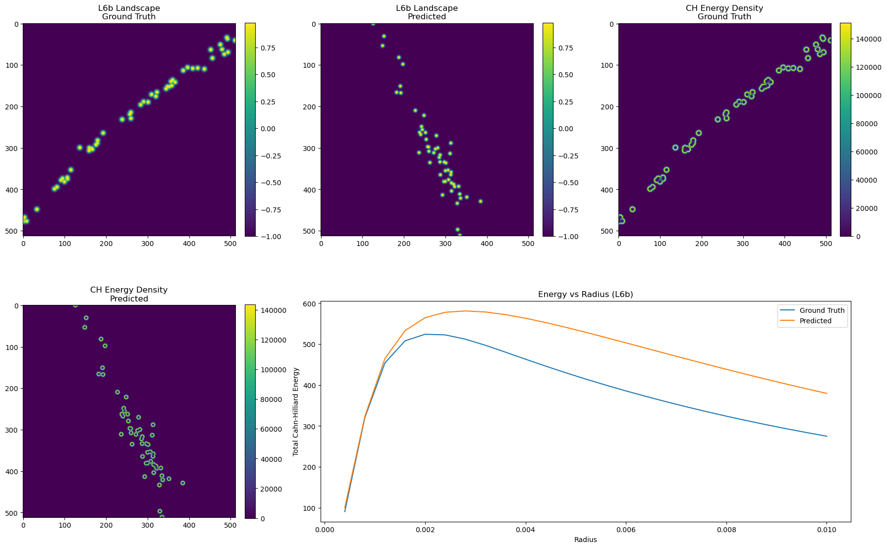
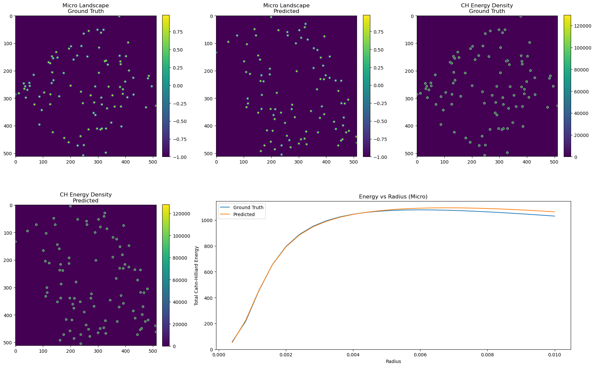
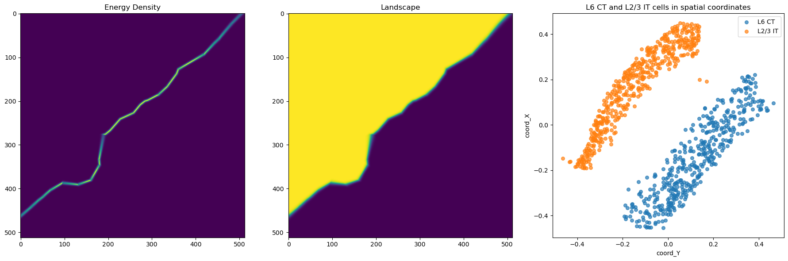
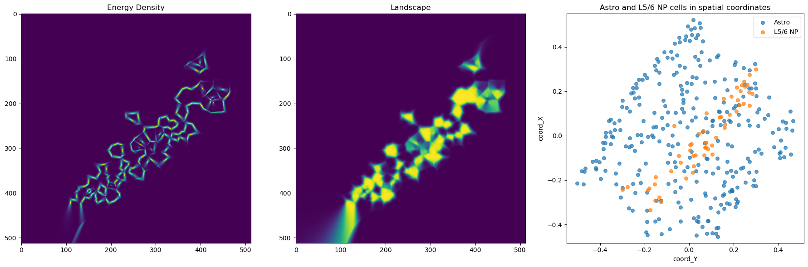
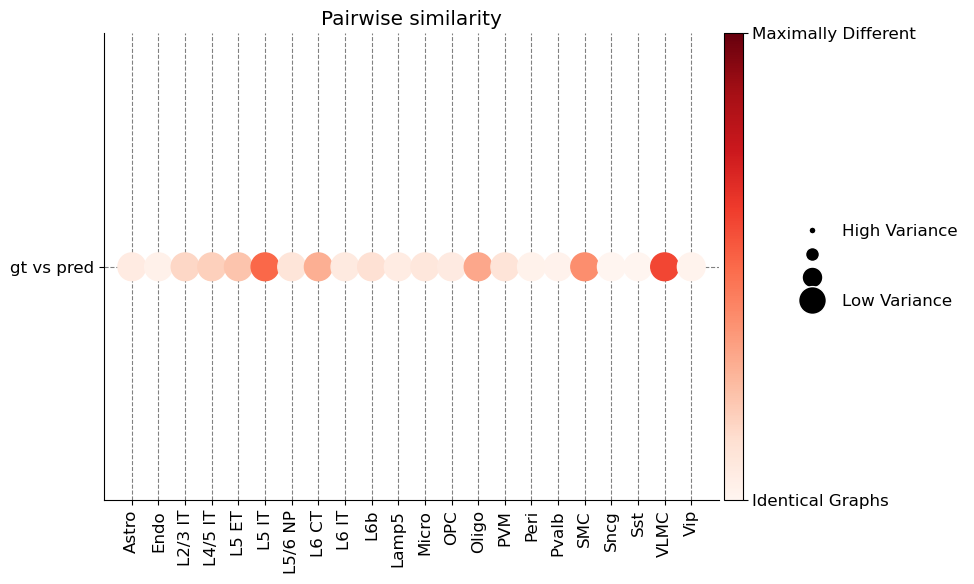

# Cellular Tissue Spatial Metrics

This repository collects small experiments and utilities for characterizing the
spatial organization of cells in tissue slices. The code focuses on comparing
ground-truth and predicted cell layouts with metrics drawn from spatial
statistics, graph spectra, graph portraits, and continuous energy landscapes.

## Repository Contents

### `data-lookup`

Utilities for loading cell-level CSV data into `AnnData` objects and measuring
gene-expression deviations across spatial grids.

### `ripleys-k-functions`

Ripley's K, Besag's L, and pair-correlation functions for quantifying whether
cells of a chosen type are clustered, dispersed, or approximately random across
the tissue plane.

### `spectral-graph-entropy`

Graph Laplacian tools for building spatial cell graphs, estimating connectivity,
computing spectral gaps, and measuring Von Neumann entropy from graph spectra.

### `cahn-hilliard-energy`

Continuous landscape builders and Cahn-Hilliard-style energy measurements for
turning discrete cell coordinates into fields that can be compared by spatial
phase structure.

To measure a single cell type cohesion we can compute the energy of the tissue landscape considering that cells are from a phase and the empty space from the opposite phase.

To measure how mixed different cell types are we can build landscapes from 2 different cell types using Voronoi like uilt diagrams and the compute the Cahn-Hilliard energy of these landscapes

### `graph-compass`

Notebook experiments using graph portrait comparisons to evaluate similarities
between cell-type-specific spatial graphs. This was made using Graph-Compass library

